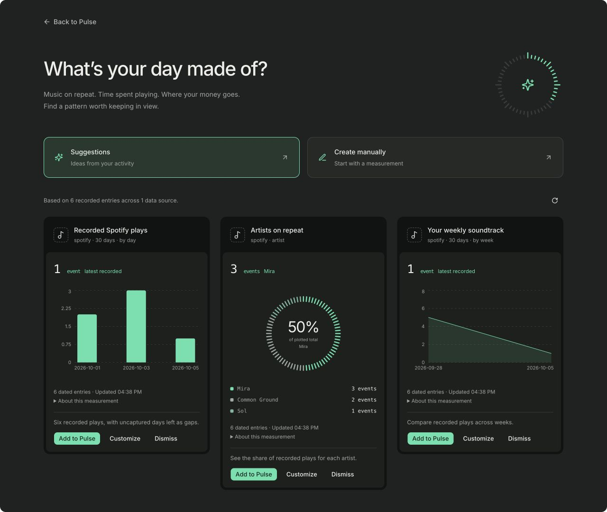
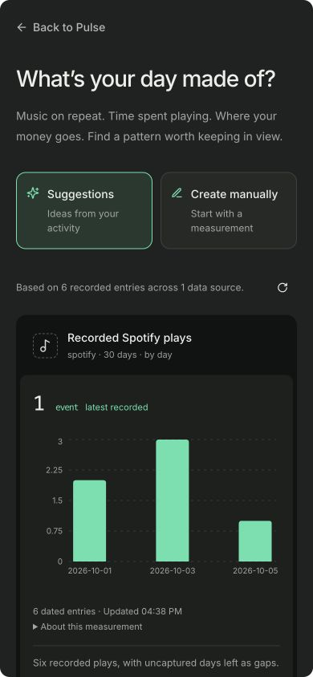

# Pulse chart and creation-page redesign

The plus button opens a full page. Suggestions and Create manually are persistent page choices; customization and the manual measurement picker stay inline. No creation dialog is mounted.

The supplied visual reference guides the charcoal card shell, inset plotting surface, dashed source icons, mint graphics, larger numeric values and compact legends. Pie charts use a segmented ring showing the largest category's share of the actual plotted total. Time series preserve null gaps. Categorical bars remain real aggregates, without fabricated distributions or percentiles. Measurement details expand in place.

Pinterest reference inspected: [Dark dashboard UI – line chart](https://in.pinterest.com/pin/580471839478962101/). Agent Reach's Exa backend was unavailable; web search and the normal Pinterest page supplied the reference.

Palette: canvas #202221, header #111312, plot #1d201e, foreground #eeeeeb, muted #a0a6a2, mint #52e2ac. Existing app typography is retained; monospaced values distinguish measurements. Responsive collection columns retain a card's compact width even with one result. The builder uses a control column and a live preview, stacked on narrow screens.

Verification: desktop production build, changed-file ESLint, three Pulse settings tests, and diff checks pass. Browser fixtures verify manual selection, categorical customization, segmented-ring preview, save/return, 1280px and 390px layouts, zero dialog elements and no horizontal overflow. Screenshots use six synthetic Spotify plays; they are not live account evidence. The Core API and database are unchanged.

